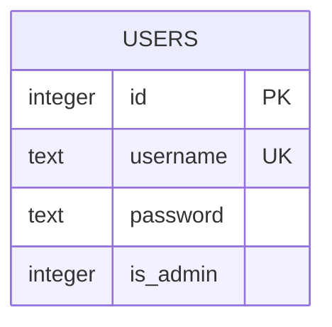
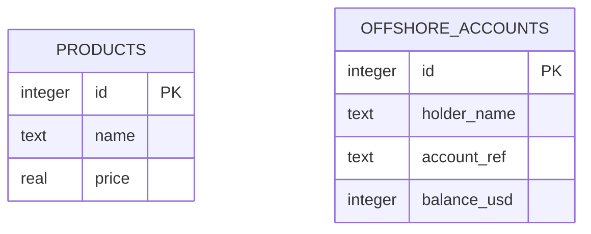
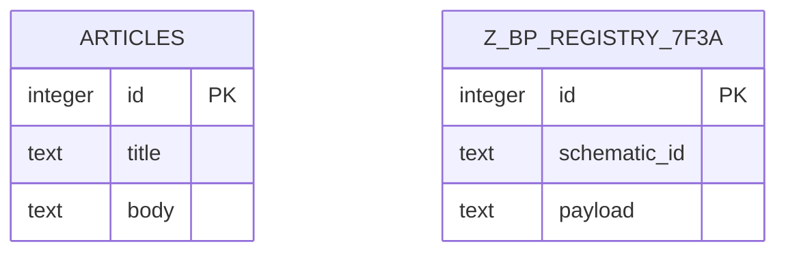

# 05 — Veri Modeli (SQL Heist · data-modeler)

> Gate 2 çıktısı. **KİLİTLENMİŞ KONTRAT** (`locked-contract.md`) + architect'in KANONİK
> level-JSON şeması (`01-architecture.md` §4/§5) + planner semantiği (`02-game-design.md`)
> üstüne yazıldı. **RAKİP şema üretilmez** — architect'in `Level` tipi alan-alan detaylandırılır;
> her JOB için hedef DB şeması + seed + loot değerleri + win-condition'ın JSON temsili tanımlanır.
> Statü: **TASLAK — parent onayı bekliyor.** · Sürüm: v0.1
>
> **Sahiplik (01 §0):** Şema ŞEKLİ + engine + win-condition DSL BİÇİMİ → architect (kanonik).
> Alan-alan tip detayı + hedef DB şema/seed/loot satırı + ER → **bu doküman (05)**.
> Loot'un hangi semantikte kazanç sayıldığı → planner (02). Payload DOĞRULUĞU → security-analyst (03).

---

## 0. Kilitli kararlar ve çelişki çözümü (bu dokümanın uyduğu invariant'lar)

Aşağıdakiler `locked-contract.md`'te DONDURULDU; veri modeli bunlara **birebir** hizalanır.

| # | Karar | Kaynak | Bu dokümana etkisi |
|---|-------|--------|--------------------|
| K1 | Enjeksiyon HAM, escape YOK (`{{input:field}}` → ham input) | LC §B | Seed + template payload'ın ham enjeksiyonla çalışacağı varsayımıyla tasarlandı |
| K2 | Front Door win = `row-match { is_admin:1 }` | LC §D | `users` tablosunda `is_admin` kolonu; template `is_admin`'i PROJEKTE eder |
| K3 | Vault UNION = **3 kolon** | LC §D | Görünür `products(id,name,price)` = 3 projeksiyon; loot tablosundan 3-kolon UNION |
| K4 | Blueprint UNION = **2 kolon** | LC §D | Görünür `articles(title,body)` = 2 projeksiyon; keşfedilen tablodan 2-kolon UNION |
| K5 | Loot değerleri (X vault, Y blueprint) **yalnızca** hedef tabloda seed'lenir | 02 §13 | Flag string'leri görünür seed'in HİÇBİR yerinde geçmez (anti-false-positive) |
| K6 | Vault loot tablosu **BİLİNİR**; Blueprint loot tablosu **BİLİNMEZ** (keşfedilir) | LC §D, 02 §12 | Vault loot tablosu `visibleSchema`'da; Blueprint loot tablosu `visibleSchema`'dan GİZLENİR |

### 0.1 Çözülen çelişkiler (architect skeleton ↔ locked contract)

- **Front Door win-condition:** architecture §8.1 illüstratif `rows-returned{min:1}` verir; **locked
  contract §D bunu `row-match{is_admin:1}` ile GEÇERSİZ kılar** (planner "privileged-row" →
  architect `row-match`). Bu doküman `row-match`'i kullanır. Gerekçe: sadece "≥1 satır" değil,
  **ayrıcalıklı (admin) satırın** çekilmesi kazanç olmalı (pedagoji: hedef = admin erişimi).
- **Front Door template projeksiyonu:** architecture §8.1 `SELECT id, username, role …` verir; K2
  gereği sonuç kümesinde `is_admin` GÖRÜNMELİ ki saf `WinEvaluator` kolon-adıyla eşleştirebilsin.
  Bu yüzden projeksiyon `id, username, is_admin` olur (architect template BİÇİMİNE sadık; yalnız
  projekte edilen kolon listesi win'e uyacak şekilde seçildi).
- **Vault kolon sayısı:** architecture §8.2 illüstratif "2 kolon" verir; **locked contract §D
  "Vault = 3 kolon" ile GEÇERSİZ kılar** (planner §4.2 zaten 3 kullanıyordu). Bu doküman 3 kolon.
- **Win-condition JSON biçimi:** locked §C = architect'in KANONİK §5.2 union'ı (Zod valide eder):
  `row-match { expect: Array<Record<string,SqlCell>>; mode: 'subset'|'exact' }`. Front Door için
  **`mode:'subset'` + tek elemanlı `expect` dizisi** (`[{ is_admin: 1 }]`); semantik: "sonuçta
  `is_admin=1` olan bir satır VAR". §3.1 ve §1.3'te makine-okur JSON bu kanonik biçimdedir.

---

## 1. LEVEL JSON ŞEMASI — alan-alan spesifikasyon (architect §4 KANONİK)

Aşağıdaki `Level` tipi **architect kilidindedir**; burada yalnızca alan-alan tip + amaç + sahip
+ 05'in doldurduğu değer notu eklenir. `[E]` = engine tüketir (ad/tip architect-kilitli),
`[C]` = içerik/semantik (02/05/06 doldurur). Kırıcı değişiklik = `schemaVersion` bump.

```ts
// content/levels/*.json · KANONİK v1 (architect 01 §4) — RAKİP DEĞİL, birebir referans
interface Level {
  schemaVersion: 1                             // [E]
  id: string                                   // [E] slug — route [jobId] + ilerleme anahtarı
  order: number                                // [C]
  job: string                                  // [C]
  title: string                                // [C]
  technique: TechniqueId                       // [E] müfredat sınıflaması (enum)
  difficulty: 'intro'|'easy'|'medium'|'hard'   // [C]
  brief:   { handler: string; text: string; objective: string }                         // [C]
  debrief: { explanation: string; vulnerableCode: CodeSnippet; secureCode: CodeSnippet; takeaway: string } // [C metin / 03 doğruluk]
  target:  { appName: string; surface: SurfaceKind; fields: InputField[] }               // appName/fields[].label [C] · surface + fields[].name/type [E]
  database:{ schemaSql: string; seedSql: string; visibleSchema: VisibleTable[] }          // [E] — 05 doldurur
  query:   { template: string; description?: string }                                    // template [E] · description [C]
  winCondition: WinCondition                   // [E] discriminated union (§1.3)
  hints: Hint[]                                // [C] kademeli ipuçları (02 yapısı, 03/06 metni)
  expectedSolution: { inputs: Record<string,string>; note?: string }                     // inputs shape [E] / value [C, 03 doğrular]
  scoring?: ScoringConfig                      // [C] planner (LC §F)
  tags?: string[]                              // [C]
}
```

### 1.1 Alan-alan tablo (05'in doldurduğu değer sözleşmesi)

| Alan | Tip | Sınıf | Sahip | 05 notu / değer kuralı |
|------|-----|-------|-------|------------------------|
| `schemaVersion` | `1` (literal) | [E] | architect | Sabit `1`; bump = architect-gate |
| `id` | `string` | [E] | architect | `front-door` \| `vault` \| `blueprint` (slug; route + progress key) |
| `order` | `number` | [C] | planner | `1` \| `2` \| `3` (heist yayı sırası) |
| `job` / `title` | `string` | [C] | copywriter | In-world ad (ör. "The Front Door") |
| `technique` | `TechniqueId` | [E] | architect | `auth-bypass` \| `union-extraction` \| `schema-discovery` (§1.2) |
| `difficulty` | enum | [C] | planner | `intro` \| `medium` \| `hard` |
| `brief.*` | `string` | [C] | copywriter | Tekniği spoil etmeden telegraf |
| `debrief.*` | obj | [C]/03 | copywriter/security-analyst | vuln↔secure kod + açıklama |
| `target.surface` | `SurfaceKind` | [E] | architect | Hangi mimik UI (§1.2) |
| `target.fields[]` | `InputField[]` | [E] | architect | `name` = template token; 05 template↔field eşler |
| `database.schemaSql` | `string` | **[E] · 05** | **data-modeler** | Taze DB DDL (§3, §5) |
| `database.seedSql` | `string` | **[E] · 05** | **data-modeler** | Seed + loot satırları (§3, §5) |
| `database.visibleSchema` | `VisibleTable[]` | **[E] · 05** | **data-modeler** | Recon'da görünen şema; **Blueprint loot tablosu HARİÇ** (K6) |
| `query.template` | `string` | [E] | architect (biçim) / 05 (değer) | `{{input:field}}` token'lı zafiyetli SQL (§3 per-job) |
| `winCondition` | `WinCondition` | **[E] · 05** | **data-modeler** | §1.3 union; `flag`/`expect` seed'le birebir (K5) |
| `hints[]` | `Hint[]` | [C] | planner/03/06 | 3 kademe (nudge→technique→near-solution) |
| `expectedSolution.inputs` | `Record<string,string>` | [E-shape/C-val] | 05 shape / 03 value | Bilinen-iyi payload; test-harness `won===true` bekler |
| `scoring?` | `ScoringConfig` | [C] | planner | LC §F değerleri |
| `tags?` | `string[]` | [C] | serbest | — |

### 1.2 Yardımcı tipler (architect §4 — birebir)

```ts
type TechniqueId =
  | 'auth-bypass' | 'comment-injection' | 'column-count'
  | 'union-extraction' | 'schema-discovery'
  // v1 rezerve: 'error-based' | 'blind-boolean' | 'blind-time' | 'stacked' | 'second-order' | 'waf-bypass'

type SurfaceKind = 'login-form' | 'search-box' | 'url-param' | 'profile-lookup'

interface InputField {
  name: string                                 // [E] template token adı ({{input:name}})
  label: string                                // [C] UI etiketi
  type: 'text' | 'password' | 'search' | 'number' // [E] mimik input türü
  placeholder?: string                         // [C]
}

interface VisibleTable { table: string; columns: string[] } // recon şema kartı (GİZLİ tablo dışarıda)
interface CodeSnippet  { language: string; code: string }   // debrief (çalıştırılmaz düz metin)
interface Hint { id: string; text: string; cost?: number; revealAfterAttempts?: number }
interface ScoringConfig { basePoints?: number; hintPenalty?: number; timeBonus?: boolean }

type SqlCell = string | number | Uint8Array | null // exec hücre tipi (architect §3.2)
```

### 1.3 `WinCondition` union (architect §5.2 — KANONİK, Zod bunu valide eder)

```ts
type WinCondition =
  | { type: 'rows-returned'; min: number; max?: number; reason?: string }
  | { type: 'flag-in-result'; flag: string; column?: string; caseSensitive?: boolean; reason?: string }
  | { type: 'row-match'; expect: Array<Record<string, SqlCell>>; mode: 'subset' | 'exact'; reason?: string }
```

**Değerlendirme semantiği (architect §5.2, 05 için hatırlatma):**
- `rows-returned` → `rowCount ≥ min && (max==null || rowCount ≤ max)`.
- `flag-in-result` → herhangi hücre (veya `column` verildiyse o kolon) `flag`'i **içerir**
  (`caseSensitive` varsayılan `false`). `flag`, seed'de var olan gizli değerdir; **05 seed'iyle
  birebir eşleşmeli** (tek-kaynak). MVP'de Vault + Blueprint bunu kullanır.
- `row-match` → `subset`: beklenen HER satır sonuçta var (kolon-adıyla, **kısmi** kolon eşleşmesi);
  `exact`: kümeler birebir. MVP'de Front Door `subset` + tek elemanlı `expect` kullanır.

> MVP'de `rows-returned` HİÇBİR job'da kullanılmaz (Front Door `row-match`'e taşındı, K2). Şemada
> kalır (v1 + engine tam DSL testi için).

---

## 2. Standart modelleme sözleşmesinden BİLİNÇLİ sapma (DOKÜMANTE)

data-modeler'ın "her tabloda `id`+`created_at`+`updated_at` ZORUNLU, FK ZORUNLU, soft-delete
`deleted_at`" kuralı **PRODÜKSİYON app şemaları** içindir. Buradaki tablolar **efemeral,
in-memory, level-başına-taze SALDIRI HEDEFİ fixture'larıdır** (architect §2.2). Bilinçli sapmalar:

| Standart kural | Buradaki karar | Gerekçe (trade-off) |
|----------------|----------------|---------------------|
| `created_at` / `updated_at` ZORUNLU | **YOK** | (a) Kolon sayısını şişirir → **Vault=3 / Blueprint=2 UNION kilidini KIRAR** (K3/K4); (b) efemeral hedefte audit anlamsız; (c) klasik-zafiyetli legacy tablo görünümü pedagojik olarak daha gerçekçi |
| `id` = UUID önerilir | **INTEGER PRIMARY KEY** | SQLite idiyomu (rowid alias); seed sade; UUID payload/seed'i gereksiz uzatır |
| FK constraint ZORUNLU (ON DELETE) | **FK YOK** | Görünür tablo ↔ loot tablosu **bilerek İLİŞKİSİZ**; çapraz-tablo UNION'ın dersi tam da bu ayrıklıktır. FK/JOIN yolu koymak enjeksiyon dersini bulandırır |
| soft-delete `deleted_at` + partial index | **YOK** | Efemeral saldırı hedefi; silme senaryosu yok |
| Index optimizasyonu | **YOK** (PK dışında) | Tablolar 3–4 satır; seq-scan zaten anlık. Index eklemek WASM DB boyutunu ve sqlite_master gürültüsünü (autoindex) artırır → **Blueprint keşfini kirletir** (§6) |
| Normalizasyon (3NF) | Zaten 3NF (tek-varlık tablolar, transitive bağımlılık yok) | Kasıtlı denormalizasyon YOK; tablolar atomik |

> **Kanonik uyarı:** `AUTOINCREMENT` KULLANILMAZ (yalın `INTEGER PRIMARY KEY`) — aksi halde SQLite
> `sqlite_sequence` iç tablosu yaratır ve Blueprint'in `sqlite_master` dökümünü gürültüler (§6.2).

---

## 3. Per-job hedef DB modeli (şema + ER + seed + win + payload)

Her job taze bir SQLite DB'ye karşı çalışır. Aşağıda job başına: teknik, yüzey, zafiyetli
`query.template`, tablolar (DDL illüstrasyon), kolon tablosu (PK/UK/tip), Mermaid ER, seed
satırları, loot, `winCondition` JSON (kanonik §1.3), `expectedSolution`, kolon-sayısı/UNION
uyumu ve anti-trivial kontrolü.

---

### 3.1 JOB 1 · The Front Door — Auth bypass (`auth-bypass`)

- **`target.surface`:** `login-form` · **`target.fields`:** `username` (text), `password` (password)
- **`query.template`** (2 token, `is_admin` PROJEKTE edilir → K2):

```sql
SELECT id, username, is_admin
FROM users
WHERE username = '{{input:username}}' AND password = '{{input:password}}'
```

**Tablo — `users`** (tek varlık; FK yok):

| Kolon | Tip | Anahtar | Not |
|-------|-----|---------|-----|
| `id` | INTEGER | **PK** | rowid alias (AUTOINCREMENT yok) |
| `username` | TEXT | **UK** | login kimliği |
| `password` | TEXT | — | düz metin (kasıtlı legacy vuln); WHERE'de kullanılır, projekte EDİLMEZ |
| `is_admin` | INTEGER | — | 0/1 ayrıcalık bayrağı; **win predikatı** (`is_admin=1`) |



**Seed (`seedSql` — illüstrasyon):**

| id | username | password | is_admin |
|----|----------|----------|----------|
| 1 | `admin` | `S3cr3t!Adm1n` | **1** |
| 2 | `j.marlow` | `hunter2` | 0 |
| 3 | `k.rivera` | `letmein123` | 0 |
| 4 | `svc_backup` | `b4ckup$vc` | 0 |

- **Loot:** Ayrıcalıklı satırın kendisi (admin, `is_admin=1`). Ayrı flag string YOK — kazanç =
  admin satırının sonuç kümesinde belirmesi (K2).
- **`winCondition` (JSON, kanonik §1.3):**

```json
{ "type": "row-match", "expect": [ { "is_admin": 1 } ], "mode": "subset",
  "reason": "Ayrıcalıklı hesap çekildi — ön kapı açık, içeridesin." }
```
> Kanonik biçim: tek-elemanlı `expect` dizisi + `mode:"subset"` = "sonuçta `is_admin=1` olan bir
> satır VAR". Kısmi kolon eşleşmesi (`is_admin` dışındaki kolonlar umursanmaz).

- **`expectedSolution.inputs`** (03 doğrular; iki yol da kazandırır):

```json
{ "inputs": { "username": "' OR '1'='1' --", "password": "x" },
  "note": "Alternatif: username = \"admin' --\" (password predikatı yorumlanır)." }
```

- **Kompoze SQL (tautology yolu):**
  `SELECT id, username, is_admin FROM users WHERE username = '' OR '1'='1' --' AND password = 'x'`
  → tüm satırlar döner → içlerinde `is_admin=1` (admin) VAR → **won**.
- **`admin' --` yolu:** `… WHERE username = 'admin' --' AND password = '…'` → yalnız admin satırı
  → `is_admin=1` → **won**.
- **Anti-trivial (R2 / 02 §13):** Benign giriş (`admin`/`wrong` veya boş/boş) → password predikatı
  tutmaz → **0 satır** → `is_admin=1` satır YOK → **won=false**. Enjeksiyon olmadan kazanılamaz. ✓

---

### 3.2 JOB 2 · The Vault — UNION extraction (`union-extraction`, önce `column-count`)

- **`target.surface`:** `search-box` · **`target.fields`:** `q` (search)
- **`query.template`** (**3 kolon** PROJEKTE → K3):

```sql
SELECT id, name, price
FROM products
WHERE name LIKE '%{{input:q}}%'
```

**Tablolar** (ikisi İLİŞKİSİZ — çapraz-tablo UNION dersi; FK yok):

`products` (görünür arama yüzeyi):

| Kolon | Tip | Anahtar | Not |
|-------|-----|---------|-----|
| `id` | INTEGER | **PK** | 3-kolon projeksiyonun 1. kolonu |
| `name` | TEXT | — | LIKE hedefi |
| `price` | REAL | — | — |

`offshore_accounts` (loot tablosu — **BİLİNİR**, K6 → `visibleSchema`'da):

| Kolon | Tip | Anahtar | Not |
|-------|-----|---------|-----|
| `id` | INTEGER | **PK** | UNION'a alınmaz (oyuncu 3 kolon seçer) |
| `holder_name` | TEXT | — | UNION kolon 1 |
| `account_ref` | TEXT | — | UNION kolon 2 · **VAULT LOOT flag'i burada** |
| `balance_usd` | INTEGER | — | UNION kolon 3 |


> İlişki (FK) YOK — bilinçli. UNION, iki ilgisiz tabloyu aynı sonuç kümesinde birleştirir; ders bu.

**Seed — `products`:**

| id | name | price |
|----|------|-------|
| 1 | Titanium Briefcase | 1200.00 |
| 2 | Carbon Lockpick Set | 340.00 |
| 3 | Signal Jammer X2 | 890.00 |
| 4 | Thermal Drill | 2100.00 |

**Seed — `offshore_accounts`** (loot satırı = id 3):

| id | holder_name | account_ref | balance_usd |
|----|-------------|-------------|-------------|
| 1 | Halcyon Holdings | `AC-1002-CH` | 250000 |
| 2 | Meridian Trust | `AC-1055-KY` | 780000 |
| 3 | **Blacklane LLC** | **`LOOT-VAULT-9F2C4471`** | 4500000 |
| 4 | Orion Offshore | `AC-1099-VG` | 1200000 |

- **VAULT LOOT (X) = `LOOT-VAULT-9F2C4471`** — yalnız `offshore_accounts.account_ref`'te (K5);
  `products`'ta ya da başka hiçbir yerde GEÇMEZ.
- **`winCondition` (JSON, kanonik §1.3):**

```json
{ "type": "flag-in-result", "flag": "LOOT-VAULT-9F2C4471", "caseSensitive": true,
  "reason": "Kasa manifestosu sonuç ızgarasında — çapraz-tablo UNION tuttu." }
```
> `column` verilmez → tüm hücrelerde aranır (oyuncu flag'i hangi UNION slotuna koyarsa koysun
> kazanır; payload varyasyonlarına dayanıklı). `caseSensitive:true` → benzersiz token, yanlış-pozitif yok.

- **`expectedSolution.inputs`** (03 doğrular):

```json
{ "inputs": { "q": "' UNION SELECT holder_name, account_ref, balance_usd FROM offshore_accounts -- " },
  "note": "Önce kolon sayısı: ' ORDER BY 3 --  OK, ' ORDER BY 4 --  hata → 3 kolon." }
```

- **Kolon-sayısı/UNION uyumu (KİLİT K3):** template 3 kolon projekte eder →
  `' ORDER BY 3 -- ` OK, `' ORDER BY 4 -- ` **error**; `' UNION SELECT NULL,NULL,NULL -- ` OK,
  `' UNION SELECT NULL,NULL -- ` **error** → oyuncu 3'ü keşfeder. Loot UNION 3 değer taşır.
- **Kompoze SQL:**
  `SELECT id, name, price FROM products WHERE name LIKE '%' UNION SELECT holder_name, account_ref, balance_usd FROM offshore_accounts -- %'`
  → tüm products ∪ tüm offshore_accounts → `LOOT-VAULT-9F2C4471` hücresi belirir → **won**.
- **Anti-trivial:** Benign arama (ör. `q="Drill"`) yalnız `products` satırlarını döndürür → flag YOK
  → **won=false**. Flag'e ancak gizli tablodan UNION ile ulaşılır. ✓

---

### 3.3 JOB 3 · The Blueprint — Schema discovery (`schema-discovery`)

- **`target.surface`:** `search-box` · **`target.fields`:** `q` (search)
- **`query.template`** (**2 kolon** PROJEKTE → K4):

```sql
SELECT title, body
FROM articles
WHERE title LIKE '%{{input:q}}%'
```

**Tablolar:**

`articles` (görünür yüzey · `visibleSchema`'da):

| Kolon | Tip | Anahtar | Not |
|-------|-----|---------|-----|
| `id` | INTEGER | **PK** | projekte EDİLMEZ (template `title, body` seçer) |
| `title` | TEXT | — | UNION kolon 1 · LIKE hedefi |
| `body` | TEXT | — | UNION kolon 2 |

`z_bp_registry_7f3a` (loot tablosu — **BİLİNMEZ / GİZLİ**, K6 → `visibleSchema`'da **YOK**):

| Kolon | Tip | Anahtar | Not |
|-------|-----|---------|-----|
| `id` | INTEGER | **PK** | — |
| `schematic_id` | TEXT | — | UNION kolon 1 |
| `payload` | TEXT | — | UNION kolon 2 · **BLUEPRINT LOOT flag'i burada** |


> `Z_BP_REGISTRY_7F3A` `visibleSchema`'dan GİZLENİR → oyuncu adını tahmin edemez → `sqlite_master`
> keşfi YAPISAL olarak zorunlu (§6.1). Tablo adı bilerek tuhaf/tahmin-edilemez.

**Seed — `articles`:**

| id | title | body |
|----|-------|------|
| 1 | Quarterly Security Review | Routine audit completed, no findings. |
| 2 | New Badge System Rollout | All staff to re-enroll by Q3. |
| 3 | Facilities Maintenance Notice | Elevator B out of service. |

**Seed — `z_bp_registry_7f3a`** (loot satırı = id 1; id 2 = gerçekçilik/decoy):

| id | schematic_id | payload |
|----|--------------|---------|
| 1 | `BP-VAULT-DOOR` | **`LOOT-BLUEPRINT-3D1F8A22`** |
| 2 | `BP-HVAC-DUCT` | `duct-run-A3-to-B7` |

- **BLUEPRINT LOOT (Y) = `LOOT-BLUEPRINT-3D1F8A22`** — yalnız `z_bp_registry_7f3a.payload`'ta (K5);
  DDL'de (CREATE TABLE) veya görünür seed'de GEÇMEZ → şema dökümü tek başına kazandırmaz.
- **`winCondition` (JSON, kanonik §1.3):**

```json
{ "type": "flag-in-result", "flag": "LOOT-BLUEPRINT-3D1F8A22", "caseSensitive": true,
  "reason": "Planlar elde — gizli tablodan blueprint çekildi." }
```

- **`expectedSolution.inputs`** (final kazanan payload; keşif adımı win DEĞİL):

```json
{ "inputs": { "q": "' UNION SELECT schematic_id, payload FROM z_bp_registry_7f3a -- " },
  "note": "Adım 1 (keşif, win değil): ' UNION SELECT name, sql FROM sqlite_master WHERE type='table' --  → gizli tablo + kolonları görünür. Adım 2 = yukarıdaki inputs." }
```

- **Kolon-sayısı/UNION uyumu (KİLİT K4):** template 2 kolon → `' ORDER BY 2 -- ` OK,
  `' ORDER BY 3 -- ` **error**; UNION 2 değer. Vault (3) ile bilerek FARKLI → kolon-sayısı becerisi tekrar.
- **İki-adımlı akış:**
  1. **Keşif:** `… LIKE '%' UNION SELECT name, sql FROM sqlite_master WHERE type='table' -- %'`
     → `articles` + `z_bp_registry_7f3a` adları + CREATE ifadeleri (kolonlar) görünür. Flag YOK → **won=false** (ara-ilerleme sinyali, 02 §10.2).
  2. **Extraction:** `… LIKE '%' UNION SELECT schematic_id, payload FROM z_bp_registry_7f3a -- %'`
     → `LOOT-BLUEPRINT-3D1F8A22` belirir → **won**.
- **Anti-trivial:** (a) Benign arama → yalnız articles → flag YOK. (b) Şema dökümü (adım 1) →
  CREATE metni flag İÇERMEZ (flag satır verisi, DDL değil) → **won=false**. Kazanç yalnız gerçek
  extraction'da. ✓

---

## 4. Loot tek-kaynak matrisi (flag ↔ seed ↔ winCondition — R2/R13 kilidi)

security-analyst (03) payload'ları TAM bu değerlere üretir; test-harness bu eşleşmeyi doğrular.
Herhangi bir kopukluk (flag ≠ seed) = level çözülemez → build-time hata (R4/R2).

| Job | Loot flag (string) | Seed konumu (yalnız burada) | `winCondition` alanı | UNION kolon |
|-----|--------------------|------------------------------|----------------------|-------------|
| Front Door | — (ayrıcalıklı satır) | `users.is_admin = 1` (id 1, `admin`) | `row-match.expect[0].is_admin = 1` | yok (bypass) |
| The Vault | `LOOT-VAULT-9F2C4471` | `offshore_accounts.account_ref` (id 3) | `flag-in-result.flag` | **3** |
| The Blueprint | `LOOT-BLUEPRINT-3D1F8A22` | `z_bp_registry_7f3a.payload` (id 1) | `flag-in-result.flag` | **2** |

**Değişmez kural:** Loot flag string'i, o job'ın GÖRÜNÜR seed'inde (users/products/articles,
holder isimleri, article body'leri, decoy satırlar) ASLA geçmez → `flag-in-result` yanlış-pozitif
veremez (02 §13 R13). Flag'ler benzersiz, tahmin-edilemez token (`LOOT-<job>-<hex>`).

---

## 5. Taze-DB-per-level yükleme yaklaşımı (schema+seed JSON'a gömme)

Architect §2.2 + §3.2 (`LevelSession`) ile hizalı. Engine level'i BİLMEZ; yalnız `database.*`'ı yorumlar.

### 5.1 Gömme biçimi
- `schemaSql` ve `seedSql`, level JSON'da **tek string** olarak durur (çok-ifadeli). JSON string
  literal newline taşıyamaz → SQL, `\n` ile veya tek satıra sıkıştırılıp `;` ile ayrılarak saklanır.
  Tek/çift tırnaklar JSON kaçışıyla (`\'` gerekmez; `"` → `\"`) korunur. Payload flag'leri tırnak
  içermez (kaçış derdi yok).
- Örnek (Front Door `database` alanı, illüstrasyon):

```json
{
  "database": {
    "schemaSql": "CREATE TABLE users (id INTEGER PRIMARY KEY, username TEXT UNIQUE, password TEXT, is_admin INTEGER);",
    "seedSql": "INSERT INTO users (id,username,password,is_admin) VALUES (1,'admin','S3cr3t!Adm1n',1),(2,'j.marlow','hunter2',0),(3,'k.rivera','letmein123',0),(4,'svc_backup','b4ckup$vc',0);",
    "visibleSchema": [ { "table": "users", "columns": ["id","username","password","is_admin"] } ]
  }
}
```

### 5.2 Yaşam döngüsü (architect §2.2)
```
openLevel(level):  SQL.Database() → db.run(schemaSql) → db.run(seedSql)   // taze, in-memory
run(inputs):       compose(template, inputs) → db.exec(composedSql) → ExecutionResult   // §3 ham enjeksiyon
                   → WinEvaluator.evaluate(winCondition, ctx)   // §1.3, exec'ten AYRI
reset():           db.close() → yeniden openLevel   // stacked/DROP payload'ı sonraki denemeyi kirletemez
dispose():         db.close()   // job değişince WASM belleği serbest
```
- **Schema+seed `db.run` ile** (çoklu ifade); **saldırı sorgusu `db.exec` ile** (sonuç kümesi döner).
- **`visibleSchema` yalnız RECON UI'yi** besler — DB'nin gerçek şemasını DEĞİL. Blueprint'te
  `z_bp_registry_7f3a` DB'de VARDIR (schema+seed'de yaratılır) ama `visibleSchema`'da YOKTUR →
  keşif zorunlu (K6). Bu, "görünen ≠ var olan" ayrımının yapısal aracıdır.

### 5.3 Build-time doğrulama (R2/R4)
- 3 JSON build'de Zod ile valide edilir (architect §4 tip). Geçersiz = build hatası.
- Test-harness her level için: (a) `expectedSolution.inputs` → `won===true`; (b) benign input →
  `won===false` (anti-trivial). §3'teki her job bu iki assertion'ı geçecek şekilde tasarlandı.

---

## 6. SQLite-özgü notlar

### 6.1 `sqlite_master` (Blueprint'in kalbi)
- SQLite her DB'de sistem kataloğu `sqlite_master`'ı standart açığa çıkarır; kolonları:
  `type, name, tbl_name, rootpage, sql`. `type='table'` filtresiyle kullanıcı tabloları listelenir;
  `sql` kolonu her tablonun **CREATE ifadesini** (dolayısıyla kolon adlarını) verir.
- Blueprint keşif payload'ı: `' UNION SELECT name, sql FROM sqlite_master WHERE type='table' -- `
  → `articles` + `z_bp_registry_7f3a` + her birinin DDL'i. Gizli tablonun adını + kolonlarını
  buradan öğrenir, sonra ona UNION atar. **Yetki gerekmez** (client-side tek-kullanıcı SQLite).
- `sqlite_master` kendini listelemez; `sqlite_master`'ı gizlemenin yolu yok → bu yüzden loot
  tablosunu gizlemek için `visibleSchema`'dan ÇIKARMAK yeterli (DB'de var, recon UI'de yok).
- `sql` alanı **satır verisini içermez** → flag'i açığa vurmaz → keşim adımı win olmaz (anti-trivial).
- Not: `sqlite_master` yeni sürümlerde `sqlite_schema` olarak da adreslenebilir; `sqlite_master`
  evrensel çalışır (sql.js 1.x SQLite ≥3.x — sürüm implementation'da kilitlenir, ? doğrulanmalı).

### 6.2 Katalog temizliği
- **`AUTOINCREMENT` yok** → `sqlite_sequence` iç tablosu oluşmaz → `sqlite_master` dökümü yalnız
  bizim 2 tabloyu gösterir (temiz keşif). Yalın `INTEGER PRIMARY KEY` kullanılır.
- **UNIQUE index dikkati:** `username UNIQUE` (Front Door) SQLite'ta `sqlite_autoindex_users_1`
  (type=`index`) yaratır. Front Door'da keşif dersi YOK, sorun değil. Blueprint'te keşif olduğundan
  gizli tabloya UNIQUE KOYULMAZ (autoindex gürültüsü + `type='table'` filtresi zaten index'i eler).

### 6.3 UNION / tip / yorum davranışı
- **Dinamik tipleme:** SQLite UNION'da kolon tipi hizası ZORUNLU DEĞİL (storage-class esnek) →
  `products(id INT, name TEXT, price REAL)` ∪ `(TEXT, TEXT, INT)` sorunsuz. Kolon **SAYISI** yine de
  eşleşmeli (K3/K4 dersinin temeli) — sayı tutmazsa `SELECTs ... have different number of result columns` hatası.
- **Yorum:** `--` satır sonuna kadar; `/* */` blok da desteklenir (comment-injection tekniği için).
- **`LIKE`:** ASCII harflerinde varsayılan **case-insensitive**; `%`/`_` joker. Template'in
  sondaki `%'` parçası payload'daki `-- ` ile yoruma düşer (§3.2/§3.3 kompoze örnekleri).
- **`db.exec` tek sonuç kümesi bekler (MVP);** stacked (`;`) v1. Reset taze DB verdiği için yıkıcı
  payload izole (architect §2.4).

---

## 7. Data Model Review (özet verdict)

```
DATA MODEL REVIEW
=================
Project: SQL Heist (MVP · 3 job)
Database: SQLite (sql.js/WASM · efemeral, level-başına-taze, in-memory)

## Schema Summary
Levels: 3 | Tables: 5 (users · products · offshore_accounts · articles · z_bp_registry_7f3a)
Loot flags: 2 string + 1 privileged-row | UNION kilidi: Vault=3, Blueprint=2

## Normalization
Status: 3NF (tek-varlık tablolar, transitive/partial bağımlılık yok)
- [INFO] Kasıtlı FK-yokluğu (çapraz-tablo UNION dersi) — DOKÜMANTE (§2)
- [INFO] Audit/UUID/soft-delete kolonları bilinçli ATLANDI (UNION kolon kilidi) — DOKÜMANTE (§2)

## Index Analysis
- [INFO] PK dışı index YOK (3–4 satır/tablo; seq-scan anlık) — kasıtlı
- [WARN] Front Door `username UNIQUE` → sqlite_autoindex; keşif yok, etkisiz
- [PASS] Blueprint gizli tablo index'siz + AUTOINCREMENT'siz → temiz sqlite_master keşfi

## Migration Safety
- [PASS] Efemeral DB; migration/versioning yok. Şema evrimi = level JSON schemaVersion (architect-gate)
- [PASS] Taze-DB-per-run → yıkıcı payload izolasyonu; veri kaybı riski yok

## Recommendations
- [PRIORITY] 03 payload'ları TAM §4 flag string'lerini üretmeli; test-harness flag↔seed eşleşmesini assert etmeli
- [PRIORITY] Zod'da winCondition union'ı §1.3 KANONİK biçime bağlanmalı (row-match expect=DİZİ, mode='subset'|'exact')
- [INFO] plan-reviewer: 01↔05 UNION kolon (3/2) + template projeksiyon (is_admin) uyumunu denetlesin

VERDICT: PASS (locked-contract K1–K6 + architect §4/§5 birebir; anti-trivial her job'da sağlanır)
```

---

## Değişiklik günlüğü
| Sürüm | Tarih | Değişiklik |
|-------|-------|-----------|
| v0.1 | 2026-07-29 | İlk taslak (Gate 2 data-modeler). Level-JSON alan-alan spec, 3 job DB şema+ER+seed+loot, winCondition JSON (kanonik §1.3), taze-DB yükleme, SQLite notları, review verdict. Locked-contract K1–K6'ya birebir. |
